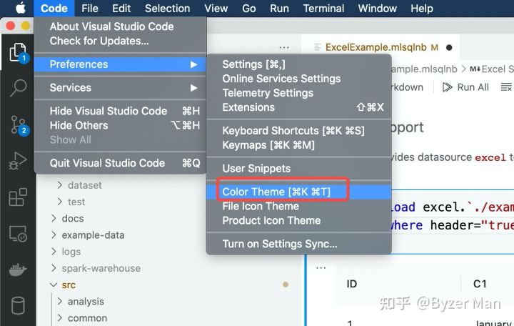

## Byzer Visualization Example

本项目主要演示 Byzer-yaml 的可视化能力。视频演示： https://m.bilibili.com/video/BV1ct4y1V7BC

## 安装 Byzer 桌面版

安装 Visual Studio Code。 [下载地址](https://code.visualstudio.com/) 然后安装他。

> 注意： 请使用 [Light Color Theme](https://code.visualstudio.com/docs/getstarted/themes) 以获得更好的用户体验




接着你可以根据操作系统，下载合适的 Byzer 扩展：

1. [Mac](https://download.byzer.org/byzer/2.3.2/byzer-vscode-extension-darwin-0.0.7.vsix)
2. [Linux](https://download.byzer.org/byzer/2.3.2/byzer-vscode-extension-linux-0.0.7.vsix)
3. [Windows](https://download.byzer.org/byzer/2.3.2/byzer-vscode-extension-win-0.0.7.vsix)


> Warnning: Windows 暂时不支持 Byzer-python,所以无法使用该项目。

点击 Visual Studio Code 中的 扩展(Extensions) 或者 View: Extensions command (Ctrl+Shift+X)


选择已经下载的好的 VSIX 文件 然后安装。


## Python 环境

Byzer-yaml 可视化依赖于 Byzer-python。 用户需要在本机安装 [Miniconda](https://docs.conda.io/en/latest/miniconda.html)。
接着在本项目中执行如下指令：

```
conda env create --file environment.yml
```

这样可以得到一个名字叫做 `ray-1.12.0` 的环境。

## 使用说明

用户可以直接打开 ./src/visual.mlsqlnb cell by cell 操作。我们已经把数据提前防止在 data目录中，并且以 delta lake 形式提供。


## 项目文件说明

### ./src/plugin.mlsqlnb

执行该 Notebook 安装 Byzer 可视化插件。

### ./src/prepare-data.mlsqlnb

这个文件主要是把一些 Python 库里的示例数据导出到 Byzer 存储中。

### ./src/basic_usage.mlsqlnb 

Byzer 的一些基础语法特性介绍。

### ./src/story2.mlsqlnb

使用 Byzer-python进行可视化

### ./src/story1.mlsqlnb

使用 Byzer-yaml 进行可视化

### ./src/visual.mlsqlnb

绘制各种图示例